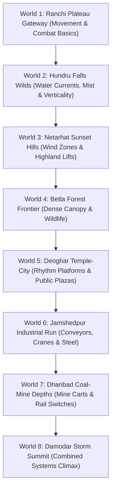

# Super-Mario-Bros
# RRR — REWIND. REIMAGINE. RECONNECT.
### Super Mario Bros: Jharkhand Quest — Full Game Vertical Slice

[](https://vercel.com/new/clone?repository-url=https://github.com/Ranjeet7680/Super-Mario-Bros)
[](https://opensource.org/licenses/MIT)
[](#)

> **Team / Creator:** RAJRANJEET7680  
> **Production Status:** Milestone 1 & 2 Playable Vertical Slice (World 1-1: Ranchi Plateau Gateway)  
> **Architecture Docs:** `Super_Mario_Bros_Jharkhand_Full_Game_Architecture.pdf` & `RRR_Fully_Detailed_20000_Word_Game_Architecture.pdf`  
> **Wiki Documentation:** Check the [`/wiki`](wiki/Home.md) folder for full game architecture guides.

---

## 📖 Executive Summary & Architecture Implementation

This project implements the design specifications and production blueprints defined across both design bibles:
1. `Super_Mario_Bros_Jharkhand_Full_Game_Architecture.pdf` (Original platforming mechanics, level flow, and Jharkhand environmental themes).
2. `RRR_Fully_Detailed_20000_Word_Game_Architecture.pdf` (Commercial original IP transition, *Rift of Echoes* narrative, Bollywood cinematic direction, bilingual localization, and layered acting).

---

## 🎮 Playable Vertical Slice Features

### 1. Player Movement Architecture (`src/game/Player.js` & `src/engine/Physics.js`)
- **Responsive Acceleration & Friction:** Separate ground and air controls with tactile stopping power.
- **Variable-Height Jump:** Holding the jump key provides extended upward boost up to a strict cap.
- **Fairness Enhancements:**
  - **Coyote Time (~120ms):** Allows jumping after walking off ledges.
  - **Jump Buffering (~120ms):** Remembers jump input pressed slightly before landing.
  - **Fast Fall:** Pressing Down (`S` or `↓`) accelerates descent for tight aerial control.
- **Dash & Combat:** Horizontal dash burst with invulnerability frames and dash attack capability.
- **Squash & Stretch:** Dynamic sprite deformation on jump launch and hard landing.
- **Character Design:** Protagonist **Kabir** outfitted in Indian traveler tunic, saffron headband, fluttering silk scarf, and hiking boots.

### 2. Camera System (`src/engine/Camera.js`)
- **Predictive Look-Ahead:** Horizon shifts smoothly in the direction of movement to reveal upcoming challenges.
- **Vertical Dead Zones:** Small hops do not bounce the camera; only sustained climbing/falling pans the view.
- **Accessible Screen Shake:** Procedural trauma-decay shake for dashes and impacts, toggleable via settings.

### 3. Procedural Audio Engine (`src/engine/Audio.js`)
- **100% Zero-External-Dependency Web Audio API Synthesizer:**
  - **Background Score:** Real-time synthesized regional folk music based on the Raag Bhupali pentatonic scale with dholak/tabla percussive grooves.
  - **Dynamic SFX:** Variable-pitch jump glides, soft landing thuds, crystal resonant Echo Shard chimes, white-noise dash whooshes, stomp pops, damage crunches, brass checkpoint chimes, and victory fanfares.

### 4. Bilingual Localization & Dialogue Engine (`src/game/DialogueManager.js`, `Localization.js`)
- **Instant Language Switching:** Seamlessly toggle between **English** and **Hindi (हिंदी)** in real-time.
- **Bollywood-Style Cinematic Direction:**
  - Dramatic black letterbox bars slide into view during NPC interactions.
  - Expressive character emotion portraits (Guru Kripal & Kabir).
  - Typewriter text pacing with sound blips, fully skippable via Space / E.

### 5. Enemies with Telegraphed Behaviors (`src/game/Enemies.js`)
- **Patrol Beetle:** Forest beetle patrolling platform ledges with twitching antennae. Stompable from above or defeatable via dash attack.
- **Forest Charger:** Regional wild charger that senses the player, pauses to stamp the ground with a flashing `!` alert telegraph, and charges across the corridor before tiring out.

### 6. World 1-1: Ranchi Plateau Gateway (`src/game/LevelData.js`, `Renderer.js`)
- **8 Distinct Micro-Sections:**
  1. *Safe Opening Landmark:* Ranchi plateau viewpoint, meeting with Mentor Guru Kripal.
  2. *Teaching Room:* Low plateau steps, teaching jump timing and first Echo Shards.
  3. *First Test:* Pacing Patrol Beetles and gap jumping.
  4. *Checkpoint Shrine 1:* Traditional brass lantern with festive prayer banner.
  5. *Escalation:* Forest Charger run with elevated safety platforms.
  6. *Secret High Canopy Route:* Bouncy spring flowers launch the player into high branches to find 3 rare Gold Echo Shards and an ancient Sohrai Mural Lore Tablet.
  7. *Combined Challenge:* Floating stone blocks over a cascade gap with mixed hazards.
  8. *Gateway Finale:* Stone Torana archway that reconnects the regional transit route!

### 7. UI / UX & Accessibility Suite
- Real-time HUD: Health hearts (`❤️❤️❤️`), Echo Shards (`💎`), Score (`⭐`), and Timer (`⏱️`).
- Pause Menu with accessibility options:
  - **Screen Shake Toggle**
  - **High Contrast Mode**
  - **Assist Mode** (Spawns recovery ledges under treacherous gaps)
  - **Master Volume Slider**
- Mobile Virtual Touch Controls with D-Pad and action buttons for smartphones and tablets.
- Post-Level Results Screen calculating completion time, shard collection ratio, and **Explorer Ranks** (S, A, B).

---

## 🚀 How to Run the Game

You can run the game in any modern browser using any of the following methods:

### Method 1: Using Node (Recommended)
```bash
# In the project directory:
npx serve .
# Open the URL shown (e.g. http://localhost:3000)
```

### Method 2: Using Python
```bash
python -m http.server 8000
# Open http://localhost:8000 in your browser
```

### Method 3: Direct File
Simply open `index.html` in Chrome, Edge, Firefox, or Safari!

---

## ⌨️ Controls Reference

| Action | Keyboard | Gamepad | Mobile Touch |
| :--- | :--- | :--- | :--- |
| **Run Left / Right** | `A` / `D` or `←` / `→` | Left Stick / D-Pad | `◀` / `▶` Virtual Buttons |
| **Variable Jump** | `W` or `Space` | `A` / `Cross` button | `⬆️` Button |
| **Dash / Stomp Attack** | `Shift`, `K`, or `X` | `X` / `RB` button | `⚡` Button |
| **Fast Fall** | `S` or `↓` | Down on D-Pad / Stick | `▼` Button |
| **Interact / Talk** | `E` or `F` | `Y` / `Triangle` | `🗣️` Button |
| **Pause / Settings** | `Escape` or `P` | `Start` / `Menu` | Top Header `⏸️` |

---

## 🗺️ Campaign Roadmap (The 8 Worlds)



---
*Created by RAJRANJEET7680 as part of the RRR / Jharkhand Quest Game Architecture initiative.*
