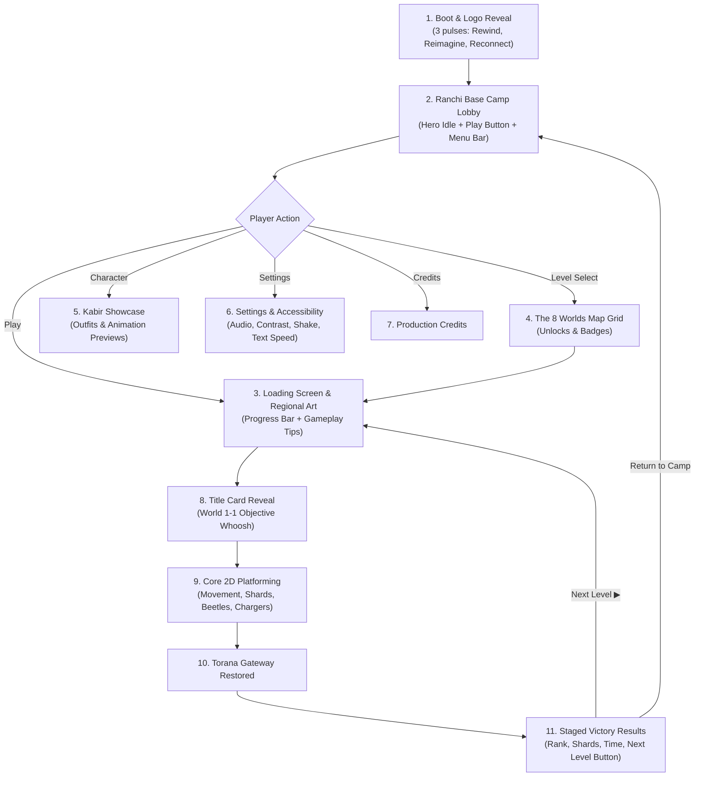

# Complete UI, Animation & Acting Architecture

Blueprint Reference: `RRR_Complete_Game_UI_Animation_Acting_Architecture_20000_FINAL.pdf`

---

## 🌟 Full Player Journey Flow

---

## 🌳 Procedural Jharkhand Botanical Architecture (`WorldRenderer.drawDetailedTree`)

Replacing flat geometric shapes with authentic, living botanical rendering of indigenous Jharkhand trees:

| Tree Species | Regional Name | Visual & Anatomical Characteristics |
| :--- | :--- | :--- |
| **Sal Tree** (*Shorea robusta*) | सखुआ / सरहुल (State Tree) | Tall tapered hardwood trunk, root flares, deep bark fissures (`#3E2723` $\rightarrow$ `#6D4C41`), branching forks, and dense multi-lobed lush emerald foliage (`#1B5E20` $\rightarrow$ `#43A047`). |
| **Palas Tree** (*Butea monosperma*) | पलाश ("Flame of the Forest") | Gnarled dark bark, decorated with clusters of fiery vermilion and orange blossoms (`#FF3D00`, `#FF9100`, `#FFEA00`) nestled between the leaves. |
| **Mahua Tree** (*Madhuca longifolia*) | महुआ | Broader spreading umbrella-like canopy with warm golden-olive foliage tones (`#33691E` $\rightarrow$ `#7CB342`). |
| **Highland Pine** | चीड़ (Netarhat Highlands) | Multi-tiered coniferous needle fans (`#0D2B14` $\rightarrow$ `#2E7D32`) with wind deflection. |

### Technical Highlights
1. **Multi-Lobe Organic Canopy:** Each tree is constructed from 9+ overlapping organic foliage lobes with dark shadow bases, mid-tone volumes, scalloped leaf cluster edges, and sunlit crescent highlight rims.
2. **Harmonic Wind Sway:** Leaves, boughs, and blossom clusters sway organically based on `Math.sin(time * 2.2) * windForce`, intensifying dynamically in wind-heavy worlds like Netarhat Hills and Damodar Storm.
3. **Soil-Anchored Placement:** Trees in the world space are anchored directly to the platform surface coordinates, giving realistic depth behind Kabir, enemies, and Echo Shards.

---

## 🎭 Character Acting Library (Appendix C)

* **Neutral / Idle:** Balanced posture, natural breathing, looking around every 8–10 seconds.
* **Determined:** Forward gaze, firm stance, scarf fluttering in the breeze.
* **Worried / Danger:** Brows raised inward, reduced motion when approaching traps.
* **Relieved:** Exhale, shoulders drop, small smile upon reaching a Checkpoint Lantern.
* **Celebrating / Victory:** Raised arms, modest smile, upward camera tilt at the Torana Gateway.
