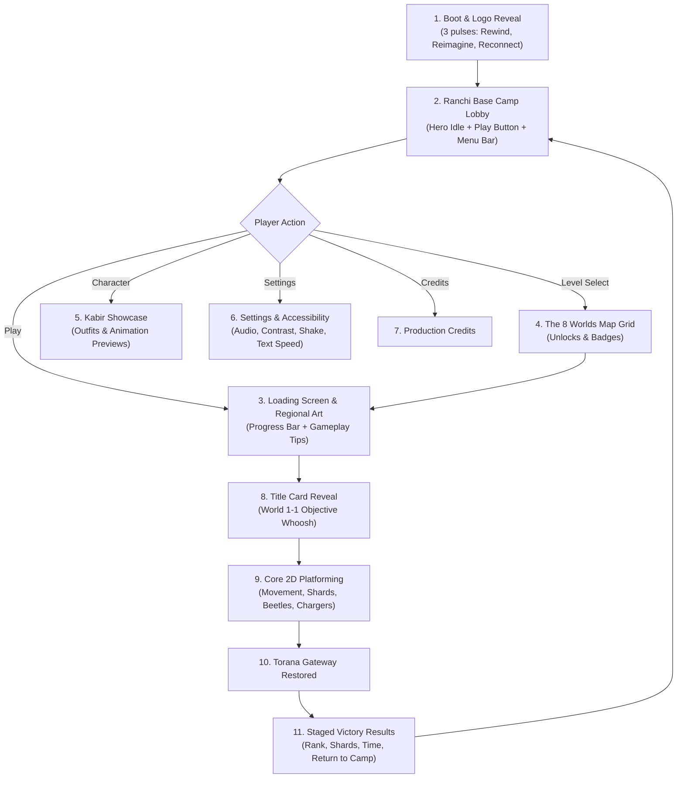

# Complete UI, Animation & Acting Architecture

Blueprint Reference: `RRR_Complete_Game_UI_Animation_Acting_Architecture_20000_FINAL.pdf`

---

## 🌟 Full Player Journey Flow

---

## 🎭 Character Acting Library (Appendix C)

* **Neutral / Idle:** Balanced posture, natural breathing, looking around every 8–10 seconds.
* **Determined:** Forward gaze, firm stance, scarf fluttering in the breeze.
* **Worried / Danger:** Brows raised inward, reduced motion when approaching traps.
* **Relieved:** Exhale, shoulders drop, small smile upon reaching a Checkpoint Lantern.
* **Celebrating / Victory:** Raised arms, modest smile, upward camera tilt at the Torana Gateway.
