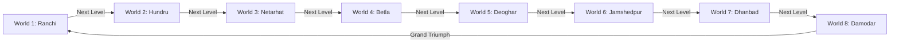

# The 8 Jharkhand Regional Worlds

Adhering to Section 6, 7-14, 21, and 35 of the Game Architecture Bible.

  

 

Every world in *RRR — Jharkhand Quest* is a complete playable level with unique atmospheric parallax shaders, environmental physics mechanics, authentic regional voice cues, and progressive level-to-level progression (`nextLevelBtn` / `LevelRegistry`).

---

### World 1-1: Ranchi Plateau Gateway
* **Visual Atmosphere:** Red soil (*Murram*) trails, Tagore Hill plateau silhouettes, Sal tree canopies, and Sohrai tribal mural line art.
* **Core Vocabulary:** Precision jump timing, Patrol Beetles, Forest Chargers, Brass Lantern Checkpoints.
* **Live Features:** Multi-tiered teaching ledges, spring flower canopy launch, and secret Sohrai Lore Tablet.
* **Soundscape:** Raag Bhupali Bansuri melody with vibrant Dholak rhythm.

---

### World 2-1: Hundru Falls Wilds
* **Visual Atmosphere:** Azure waterfall chasm, falling mist spray, white water rapids, and wet granite platforms.
* **Core Vocabulary:** Animated water current platforms with velocity push (`currentSpeed: ±80-110px/s`), vertical spring water lifts, and rainbow mist secret routes.
* **Live Features:** Moving platforms oscillating vertically over the swirling gorge.

---

### World 3-1: Netarhat Sunset Hills
* **Visual Atmosphere:** Queen of Chotanagpur crimson/magenta twilight, flying golden wind streak particles, and drifting highland fog.
* **Core Vocabulary:** Directional mountain wind forces (`windForce: 75px/s`) affecting Kabir's horizontal speed, floating cloud timber bridges, and cliff gaps.

---

### World 4-1: Betla Forest Frontier
* **Visual Atmosphere:** Dense Sal & Mahua canopy, deep emerald jungle silhouettes, and ancient Chero dynasty fort stone ruins.
* **Core Vocabulary:** Charger patrol lanes, elevated timber canopies, river Auranga crossing platforms, and fort bastion secrets.

---

### World 5-1: Deoghar Heritage-City
* **Visual Atmosphere:** Sacred Baidyanath temple courtyards, Shivaganga stepped ghats, red cloth festive canopies, and golden dawn ochre skies.
* **Core Vocabulary:** Shikhara ledges, rhythmic floating stone platforms, bell chime sound accents, and Panchshul checkpoint.

---

### World 6-1: Jamshedpur Industrial Run
* **Visual Atmosphere:** Steel foundry skyline, blast furnace chimneys, rising ember sparks, and industrial gantry walkways.
* **Core Vocabulary:** Reversible conveyor belts with animated moving chevrons (`currentSpeed: ±100-120px/s`), high crane girder moving platforms, and Jubilee Park arch.

---

### World 7-1: Dhanbad Coal-Mine Depths
* **Visual Atmosphere:** Subterranean coal shaft adit, timber scaffold supports, darkness with warm safety lamp light pools, and floating coal dust specks.
* **Core Vocabulary:** Minecart rail tracks, collapsing coal shaft ledges, subterranean pit chasms, and mineral gateway exit.

---

### World 8-1: Damodar Storm Summit
* **Visual Atmosphere:** Tempest storm clouds, dynamic periodic lightning flashes illuminating the mountain silhouettes, torrential rain streaks.
* **Core Vocabulary:** Multi-system synthesis (tempest headwind `windForce: 95px/s`, torrential water surges, oscillating cloud platforms), culminating at the Grand Jharkhand Reconnect Torana.

---

## Multi-Level Progression Architecture

* **Dynamic Save State:** Cleared regions unlock in `localStorage` (`rrr_unlocked_level`) and become permanently selectable from the Ranchi Camp Level Select Modal.
* **Victory Screen:** Level stats roll-up with Echo Shard count, completion time, and S/A/B rank rating, featuring the pulsing gold `Next Level ▶` action button.
